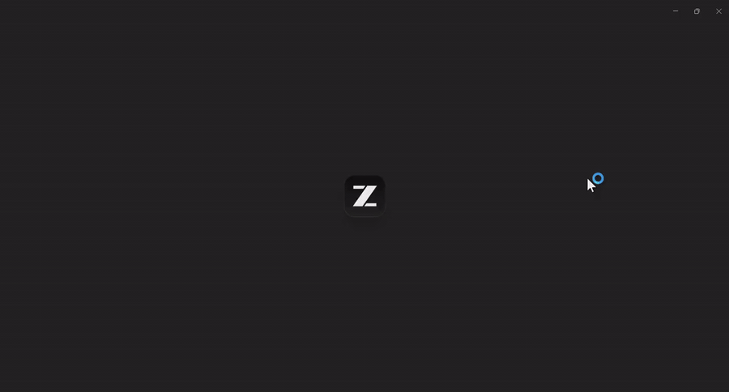
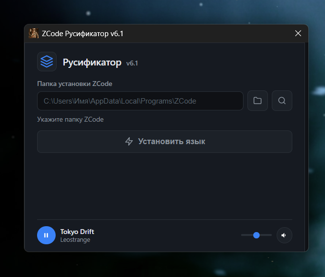

<div align="center">
  <a href="assets/Russian_UI_ZCode.mp4">
    
  </a>

  <h1>ZCode RU Patcher</h1>

  <p>
    <b>Неофициальная русификация ZCode под Windows.</b><br>
    Патчер устанавливает русский интерфейс, сохраняет резервную копию и умеет откатывать изменения.
  </p>

  <p>
    <a href="https://github.com/Leostrange/zcode-ru-patcher/releases/tag/v6.2">
      
    </a>
    
    
    
  </p>

  <p>
    <a href="https://github.com/Leostrange/zcode-ru-patcher/releases/tag/v6.2"><b>Скачать патч</b></a>
    ·
    <a href="assets/Russian_UI_ZCode.mp4">Смотреть полное MP4-демо</a>
    ·
    <a href="LEGAL_NOTICE.md">Legal Notice</a>
    ·
    <a href="https://zcode.z.ai/cn">Официальный сайт ZCode</a>
  </p>
</div>

---

## Скриншот русификатора

<p align="center">
  
</p>

## О проекте

ZCode RU Patcher - это компактный Windows-патчер для русификации ZCode. Он находит установленное приложение, создаёт резервную копию `resources/app.asar`, добавляет русский словарь и применяет дополнительные замены строк интерфейса.

Проект не связан с разработчиками ZCode и не является официальным продуктом Z.ai. Используйте патчер на свой риск и сохраняйте резервные копии важных данных.

## Как установить

1. Установите [ZCode](https://zcode.z.ai/cn) с официального сайта.
2. Если требуется обновить IDE - обновите её перед установкой патча.
3. Скачайте патч из [Releases](https://github.com/Leostrange/zcode-ru-patcher/releases/tag/v6.2), запустите его и пропатчите ZCode.
4. Дождитесь завершения процесса. Не запускайте ZCode и не мешайте патчеру, пока установка не закончится.

После каждого обновления ZCode патч придётся установить заново.

## Что нового в v6.2

- Патчер снова собран как silent-патчер, а не установщик с выбором папки.
- Исправлен краш ZCode после переключения на русский язык: русская локализация теперь применяется без подмены внутреннего locale id.
- Доработан перевод страницы “Использование”: русское форматирование дат и чисел вместо китайских `亿`, `万`, `月`, `日`.
- Допереведены hardcoded-строки Coding Plan, включая `配额`, `每日`, описания тарифов и лимитов.
- Переведены описания на страницах “Плагины” и “Навыки”.
- Патчер теперь обновляет не только `app.asar`, но и metadata-файлы навыков/плагинов.
- Обновлены обе копии `patch-core.js`: внешняя и внутренняя в `resources/app.asar`.

## Что умеет

<table>
  <tr>
    <td><b>Автопоиск ZCode</b></td>
    <td>Проверяет стандартные папки установки Windows и подставляет найденный путь.</td>
  </tr>
  <tr>
    <td><b>Ручной выбор</b></td>
    <td>Позволяет указать папку ZCode или файл <code>app.asar</code> вручную.</td>
  </tr>
  <tr>
    <td><b>Русская локаль</b></td>
    <td>Внедряет <code>ru-RU.json</code> и переключает интерфейс на русский язык.</td>
  </tr>
  <tr>
    <td><b>Дополнительные замены</b></td>
    <td>Переводит часть захардкоженных китайских и английских строк.</td>
  </tr>
  <tr>
    <td><b>Безопасный откат</b></td>
    <td>Создаёт <code>app.asar.ru-backup</code> и восстанавливает исходный файл из интерфейса.</td>
  </tr>
  <tr>
    <td><b>Прогресс установки</b></td>
    <td>Показывает этапы распаковки, патчинга и пересборки ASAR.</td>
  </tr>
</table>

## Скачать

Готовый патч находится в разделе Releases:

```text
ZCode-Ru-Patcher-v6.2-new.exe
```

SHA256:

```text
D295A30B72D5AE6F3C2C2C7C20358D22E103D242142F50F69E748562DFFD7C58
```

Ссылка: https://github.com/Leostrange/zcode-ru-patcher/releases/tag/v6.2

## Технологии

| Слой | Используется |
| --- | --- |
| Desktop UI | Electron |
| Runtime | Node.js |
| Патчинг | `@electron/asar`, файловые API Node.js |
| Интерфейс | HTML, CSS, JavaScript |
| Установщик | NSIS |
| Платформа | Windows |

## Структура

```text
main.js                  Electron main process и IPC
preload.js               Безопасный мост renderer -> main
renderer.js              Логика интерфейса, прогресса и кнопок
patch-core.js            Обнаружение ZCode, патчинг ASAR, откат
ru-RU.json               Русский словарь интерфейса
sfx_installer.nsi        Сборка Windows-установщика
assets/Russian_UI_ZCode.mp4
assets/Russian_UI_ZCode_preview.gif
assets/zcode-ru-patcher-screenshot.png
```

## Запуск из исходников

```powershell
npm install
npm start
```

## Сборка установщика

Скрипт NSIS ожидает подготовленные runtime-файлы Electron рядом с исходниками или путь через `PATCHER_DIR`.

```powershell
makensis /DPATCHER_DIR="C:\path\to\prepared\patcher" sfx_installer.nsi
```

## Лицензия

Исходный код патчера распространяется по лицензии MIT:

- [LICENSE](LICENSE) - оригинальный английский текст.
- [LICENSE.ru.md](LICENSE.ru.md) - русский перевод.

Юридическое уведомление доступно в [LEGAL_NOTICE.md](LEGAL_NOTICE.md). ZCode, Electron, Chromium, NSIS и другие сторонние компоненты распространяются на условиях их собственных лицензий. Этот репозиторий не передаёт права на ZCode и не включает официальную лицензию Z.ai.
