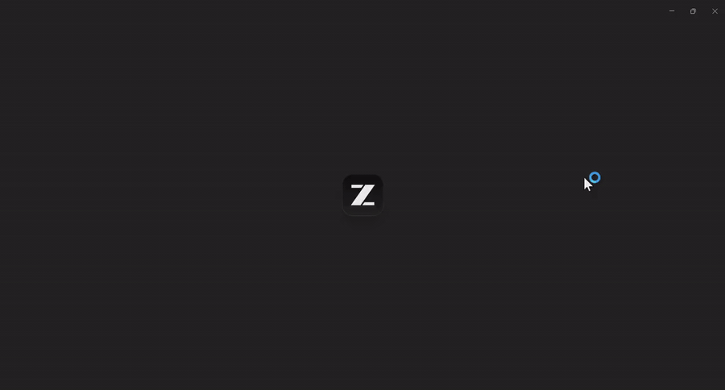
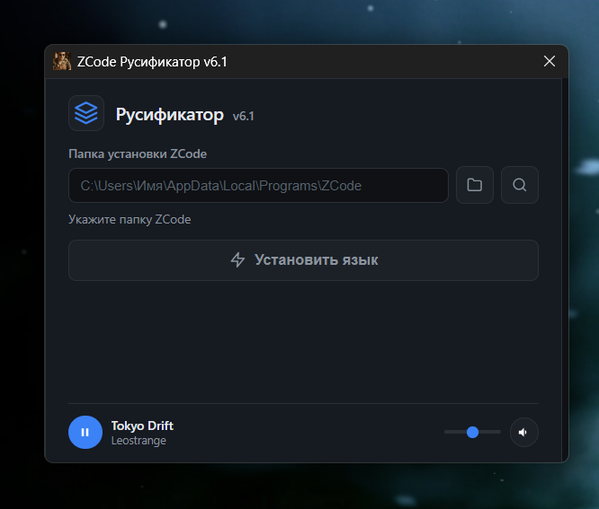

<div align="center">
  <a href="assets/Russian_UI_ZCode.mp4">
    
  </a>

  <h1>ZCode RU Patcher</h1>

  <p>
    <b>Неофициальная русификация ZCode под Windows.</b><br>
    Патчер устанавливает русский интерфейс, сохраняет резервную копию и умеет откатывать изменения.
  </p>

  <p>
    <a href="https://github.com/Leostrange/zcode-ru-patcher/releases/tag/v6.3.7">
      
    </a>
    
    
    
  </p>

  <p>
    <a href="https://github.com/Leostrange/zcode-ru-patcher/releases/tag/v6.3.7"><b>Скачать патч</b></a>
    ·
    <a href="assets/Russian_UI_ZCode.mp4">Смотреть полное MP4-демо</a>
    ·
    <a href="LEGAL_NOTICE.md">Legal Notice</a>
    ·
    <a href="https://zcode.z.ai/cn">Официальный сайт ZCode</a>
  </p>
</div>

---

## Скриншот русификатора

<p align="center">
  
</p>

## О проекте

ZCode RU Patcher - это компактный Windows-патчер для русификации ZCode. Он находит установленное приложение, создаёт резервную копию `resources/app.asar`, добавляет русский словарь и применяет дополнительные замены строк интерфейса.

Проект не связан с разработчиками ZCode и не является официальным продуктом Z.ai. Используйте патчер на свой риск и сохраняйте резервные копии важных данных.

## Как установить

1. Установите [ZCode](https://zcode.z.ai/cn) с официального сайта.
2. Если требуется обновить IDE - обновите её перед установкой патча.
3. Скачайте патч из [Releases](https://github.com/Leostrange/zcode-ru-patcher/releases/tag/v6.3.7), запустите его и пропатчите ZCode.
4. Дождитесь завершения процесса. Не запускайте ZCode и не мешайте патчеру, пока установка не закончится.

После каждого обновления ZCode патч придётся установить заново.

## Что нового в v6.3.7

- Исправлена версия внутри окна патчера: теперь отображается `v6.3.7`.
- Переведены недостающие строки боковой панели, планировщика задач, хуков и диалогов обновления.
- Добавлены замены для китайских описаний и статусов плагинов, навыков, субагентов и MCP.

- Исправлен перевод подписи вставленного большого текста, который ZCode показывает как файл-вложение.
- Переведены runtime-подписи разделов «Навыки», «Субагенты», «Серверы MCP», «Плагины» и «Команды».
- Исправлены китайские единицы времени и статус фоновой задачи в таймере тасклиста.

- Переведены оставшиеся строки раздела **Команды**, включая команды плагинов `/modernize-*`, `/restore-legacy-sessions`, `/revise-claude-md`, `/skill-gen`, `/commit`, `/code-review`, `/deploy-to-render`, `/hookify`, `/honeycomb-setup`.
- Переведены недостающие строки меню профиля, Coding Plan, тарифных преимуществ и настроек ZCode.
- Переведены статусы и подсказки MCP-серверов плагинов, включая подключение, авторизацию и ошибки URL/загрузки/соединения.
- Добавлен отдельный проход по кешу `.zcode\cli\plugins\cache`.
- Расширены переводы метаданных встроенных и Claude Code плагинов.
- Патчер пересобран как `ZCode-Ru-Patcher-v6.3.7.exe`.

Полный changelog: [CHANGELOG.md](CHANGELOG.md).

## Что умеет

<table>
  <tr>
    <td><b>Автопоиск ZCode</b></td>
    <td>Проверяет стандартные папки установки Windows и подставляет найденный путь.</td>
  </tr>
  <tr>
    <td><b>Ручной выбор</b></td>
    <td>Позволяет указать папку ZCode или файл <code>app.asar</code> вручную.</td>
  </tr>
  <tr>
    <td><b>Русская локаль</b></td>
    <td>Внедряет <code>ru-RU.json</code> и переключает интерфейс на русский язык.</td>
  </tr>
  <tr>
    <td><b>Дополнительные замены</b></td>
    <td>Переводит часть захардкоженных китайских и английских строк.</td>
  </tr>
  <tr>
    <td><b>Безопасный откат</b></td>
    <td>Создаёт <code>app.asar.ru-backup</code> и восстанавливает исходный файл из интерфейса.</td>
  </tr>
  <tr>
    <td><b>Прогресс установки</b></td>
    <td>Показывает этапы распаковки, патчинга и пересборки ASAR.</td>
  </tr>
</table>

## Скачать

Готовый патч находится в разделе Releases:

```text
ZCode-Ru-Patcher-v6.3.6.exe
```

SHA256:

```text
648629746E02606F9B51021508061FDB57C75DDCD8AE804DA7B7D5CFAFD410A7
```

Ссылка: https://github.com/Leostrange/zcode-ru-patcher/releases/tag/v6.3.6

## Технологии

| Слой | Используется |
| --- | --- |
| Desktop UI | Electron |
| Runtime | Node.js |
| Патчинг | `@electron/asar`, файловые API Node.js |
| Интерфейс | HTML, CSS, JavaScript |
| Установщик | NSIS |
| Платформа | Windows |

## Структура

```text
main.js                  Electron main process и IPC
preload.js               Безопасный мост renderer -> main
renderer.js              Логика интерфейса, прогресса и кнопок
patch-core.js            Обнаружение ZCode, патчинг ASAR, откат
ru-RU.json               Русский словарь интерфейса
sfx_installer.nsi        Параметризованная NSIS-сборка self-extractor
build-patcher.nsi        Минимальный правильный NSIS self-extractor
assets/Russian_UI_ZCode.mp4
assets/Russian_UI_ZCode_preview.gif
assets/zcode-ru-patcher-screenshot.png
```

## Запуск из исходников

```powershell
npm install
npm start
```

## Правильная сборка

Это патчер, а не обычный установщик. Его нельзя собирать как installer:

- не использовать `InstallDir`;
- не писать путь установки в реестр;
- не показывать страницы выбора папки;
- не распаковывать приложение в `AppData\Local\ZCode-RuPatcher`;
- не требовать `RequestExecutionLevel admin` без необходимости.

Правильная схема сборки:

1. NSIS работает как тихий self-extractor.
2. Payload распаковывается только во временный `$PLUGINSDIR\app`.
3. Запускается `"$PLUGINSDIR\app\ZCodeRuPatcher.exe"`.
4. После завершения временная папка очищается.

Рабочий минимальный скрипт: `build-patcher.nsi`. Параметризованный вариант для подготовленного runtime:

```powershell
makensis /DPATCHER_DIR="C:\path\to\prepared\patcher" sfx_installer.nsi
```

## Лицензия

Исходный код патчера распространяется по лицензии MIT:

- [LICENSE](LICENSE) - оригинальный английский текст.
- [LICENSE.ru.md](LICENSE.ru.md) - русский перевод.

Юридическое уведомление доступно в [LEGAL_NOTICE.md](LEGAL_NOTICE.md). ZCode, Electron, Chromium, NSIS и другие сторонние компоненты распространяются на условиях их собственных лицензий. Этот репозиторий не передаёт права на ZCode и не включает официальную лицензию Z.ai.
